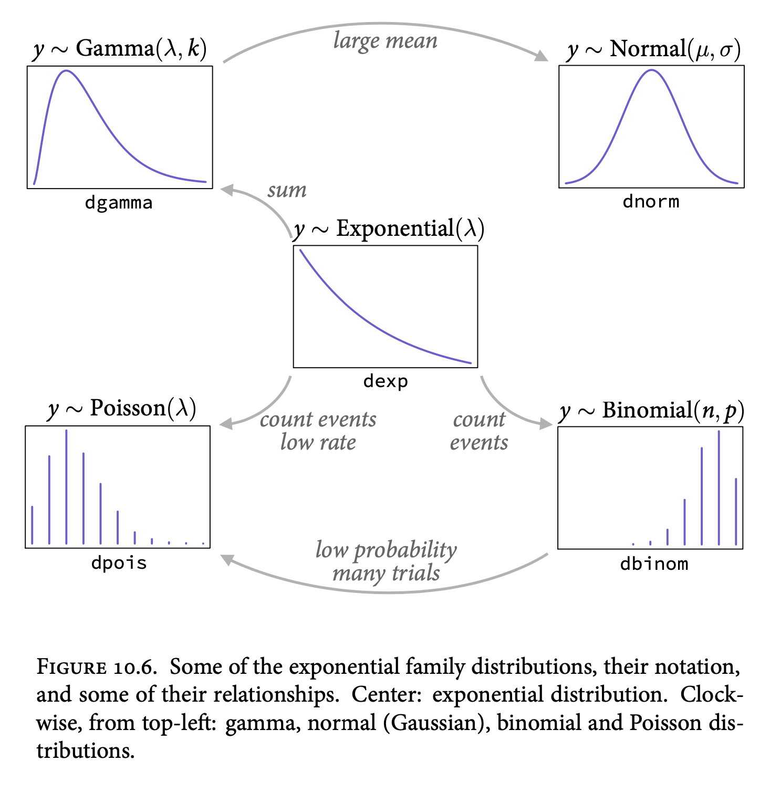

# Chapter 10 - Big Entropy and the Generalized Linear Model
```{r, include=FALSE}
library(rethinking)
```

Statistical inference requires us to make choices. Many cases we use conventional ones (e.g. Gaussian priors), but in some cases this isn't the best way to use all information.

When doing unconventional, bet on the model with the biggest entropy.

1. It's the least informative and widest - spreads probability evenly
2. Nature produces empirical distributions with high entropy
3. It works.

This chapter: _Generalized Linear Models_ (GLMs), which use non-Gaussian likelihoods, and _maximum entropy_, which helps us choose likelihood functions.

## 10.1 - Maximum Entropy

Three criteria for measures of uncertainty (ch6):

1. Continuous
2. Increase as possible events increase
3. Additive

Resulting measure for distribution $p$ is:

$$
H(p) = - \sum_i p_i \log p_i
$$

known as information entropy.

_Maximum entropy principle_ - the distribution that can happen the most ways is the one with the biggest information entropy, and is the most conservative distribution that obeys its constraints.

Pebble example - 10 pebbles in 5 buckets:

```{r}
p <- list()
p$A <- c(0,0,10,0,0)
p$B <- c(0,1,8,1,0)
p$C <- c(0,2,6,2,0)
p$D <- c(1,2,4,2,1)
p$E <- c(2,2,2,2,2)
p_norm <- lapply( p , function(q) q/sum(q)) # Normalize to make probability
( H <- sapply( p_norm , function(q) -sum(ifelse(q==0,0,q*log(q))) ) ) # compute entropy
```

The last distribution, with evenly split pebbles has the biggest entropy.

```{r}
ways <- c(1,90,1260,37800,113400) # number of ways each can be realized
logwayspp <- log(ways)/10
plot(logwayspp, H, xlab="log(ways) per pebble", ylab="Entropy")
```

This is the same information, entropy is an approximation of log ways per pebble.

The distribution with the greatest number of ways is the most plausible distribution, the _maximum entropy distribution_.

### Gaussian

Emerges from many small factors adding up, recall example of steps left and right based on coin flips. Imbalanced results are possible, but not seen in nature since there are vastly more patterns that get us to a balanced one.

If all you know about a collection of continuous values is its variance, the safest bet is that it ends up Gaussian

Generalized normal distribution:

$$
\text{Pr}(y| \mu, \alpha, \beta) = \frac{\beta}{2\alpha\Gamma(1/\beta)}\exp(-(\frac{y-\mu}{\alpha})^\beta)
$$

Gaussian with variance $\sigma^2$ is compared to several with the same variance; shape parameter $\beta$ varying 1-4, entropy maximized at 2.

**If all we are willing to assume about a collection of measurements is that they have a finite variance, then the Gaussian distribution represents the most conservative probability distribution to assign to those measurements.**

### Binomial

Given probability $p$ for an occurrence in $n$ trials, describe with a _binomial distribution_

$$
\text{Pr}(y|n,p) = \frac{n!}{y!(n-y)!}p^y(1-p)^{n-y}
$$
Factorial fraction says "how many ordered sequences of $n$ outcomes have count $y$."

Largest entropy of any that satisfies the following:

1. Two unordered events
2. Constant expected value/probability

Back to example of pulling marbles from a bag, use probabilities:

```{r}
# build list of the candidate distributions
p <- list()
p[[1]] <- c(1/4,1/4,1/4,1/4)
p[[2]] <- c(2/6,1/6,1/6,2/6)
p[[3]] <- c(1/6,2/6,2/6,1/6)
p[[4]] <- c(1/8,4/8,2/8,1/8)

# compute expected value of each
sapply( p , function(p) sum(p*c(0,1,1,2)) )
```

```{r}
# compute entropy of each distribution
sapply( p , function(p) -sum( p*log(p) ) )
```

Binomial distribution is the first, evenly divided. It's a flat line for outcome likelihoods.

What about for non-flat, $p=0.7$?

```{r}
p <- 0.7
( A <- c( (1-p)^2 , p*(1-p) , (1-p)*p , p^2 ) )
-sum( A*log(A) )
```

First output, not flat; second output, maximum entropy.

Simulate random probability functions and look at entropy:

```{r}
sim.p <- function(G=1.4) {
    x123 <- runif(3)
    x4 <- ( (G)*sum(x123)-x123[2]-x123[3] )/(2-G)
    z <- sum( c(x123,x4) )
    p <- c( x123 , x4 )/z
    list( H=-sum( p*log(p) ) , p=p )
}

H <- replicate( 1e5 , sim.p(1.4) )
dens( as.numeric(H[1,]) , adj=0.1 )
```


This is 10,000 probability distributions and their entropies.

```{r}
entropies <- as.numeric(H[1,])
distributions <- H[2,]

max(entropies)
```

Nearly identical to previous calculated entropy.

```{r}
distributions[ which.max(entropies) ]
```

Almost exactly 0.09, 0.21, 0.21, 0.49, calculated above.

Takeaways:

1. Binomial distribution is in fact maximum entropy solution for two unordered outcomes
2. We don't usually know expected value, wish to estimate - this is the same problem, since assuming the distribution has a constant expected value leads to the binomial distribution as well.
3. Likelihoods derived in chapter 2 counting up number of ways match those by maximizing entropy

## 10.2 - Generalized Linear Models

So far, all our outcomes have been continuous. For problems where that's not the case, we can use other distributions - this is a _Generalized Linear Model_, response variables that have non-normal error distributions.

Binomial example:

\begin{align*}
y_i &\sim \text{Binomial}(n,p_i)\\
f(p_i) = \alpha + \beta(x_i - \bar{x})
\end{align*}

Differences:

1. Applying the principle of maximum entropy, switch likelihood to binomial instead of Gaussian
2. Second line is replaced with a _link function_, since there's seldom a $\mu$ parameter describing average outcome - in this case the mean is described as $np$, a function of both parameters. $n$ is usually known, $p$ gets a linear model. Link function $f$ provides constraints to make it be bounded from 0 to 1.

### Meet the family

Most common distributions are the _exponential family_ - each is a maximum entropy for a set of constraints.



New ones:

**Exponential Distribution**

Constrained to greater than or equal to 0. If the probability of an event is constant in time or across space, the distribution tends toward exponential. Shape described by one parameter $\lamdba$, the rate of events. Core of survival analysis.

**Gamma Distribution**

Constrained to greater than or equal to 0. Also distance/duration, but can have non-zero peak. Used if a event can happen only after two or more exponentially distributed events happen. Maximum entropy among all distributions with same mean and average logarithm.

**Poisson Distribution**

Count distribution, special case of binomial - large, unknown $n$, and $p$ is small. Then binomial becomes Poisson with expected rate of events per unit time of $\lambda = np$.


### Linking linear models to distributions

Build a regression model from any distribution by attaching the distribution to one or more parameters that describe the distribution's shape. Use a _link function_ to avoid weird accidents (e.g. negative distances)

Link function's job is to map linear space of the model onto non-linear space of a parameter, choose $f$ with that in mind - most of the time logit or log.

**Logit Link**

\begin{align*}
    y_i &\sim \text{Binomial}(n,p_i)\\
    \text{logit}(p_i) &=  \alpha + \beta x_i
\end{align*}

Where logit is defined as log-odds:

$$
    \text{logit}(p_i) = \log \frac{p_i}{1-p_i}
$$

"Odds" being the probability an event happens divided by the odds it doesn't. To solve for $p_i$:

$$
    p_i = \frac{ \exp (\alpha + \beta x_i)}{ 1 + \exp(\alpha + \beta x_i)}
$$
Called _logistic_ or _inverse-logit_.

Performing this transform changes interpretation - unit change in predictor does not equate to a constant change in outcome; now unit change produces larger or smaller change in probability, depending on how far from 0 the log-odds are.

Key lesson - no regression coefficient from a GLM ever produces a constant change on the outcome scale. Every predictor effectively interacts with itself, and every other predictor variable.

**Log Link**

\begin{align*}
    y_i &\sim \text{Normal}(\mu,\sigma_i)\\
    \text{log}(\sigma_i) &=  \alpha + \beta x_i
\end{align*}

Log link prevents $\sigma$ from taking on negative value:

$$
    \sigma_i =  \exp(\alpha + \beta x_i)
$$

Implies exponential scaling of outcome with predictor; remember logarithms are _magnitudes_. An increase of one unit on log is an order of magnitude on the untransformed scale.


- Rethinking: link functions amount to assumptions, if not sure do _sensitivity analysis_ - explores how changes in assumptions influence inference. Some people are nervous, e.g. feels like $p$-hacking, but really the opposite - try justifiable analyses and see what's described. ** This is worth an external look outside of this text**.

### Omitted Variable bias... Again

Recall omitted variables can lead to biased inference, can happen in GLMs but worse - a variable that isn't technically a confounder can bias inference once we have a link function.

### Absolute and relative differences

Practical consequence of the link function compressing and expanding the linear range: parameter estimates don't tell you the importance of a predictor on the outcome - each parameter represents a _relative_ difference, while we're interested in _absolute_ differences.


### GLMs and information criteria

Information criteria cannot sort out which likelihood is better  - deviance is part normalizing constant, which is what information criteria are based on. Only compare models that use the same type of likelihood, maximum entropy motivates likelihood selection.

## 10.3 - Maximum Entropy Priors

Can use the principle of maximum entropy to choose priors, but not done in this text. Can interpret the principle the same way as you would with likelihoods.

## 10.4 - Summary

Conceptual chapter on maximum entropy and GLMs - choose distribution with largest information entropy. GLMs arise naturally from this approach. Link functions bind linear model to generalized outcomes, but add complexities in model specification.


