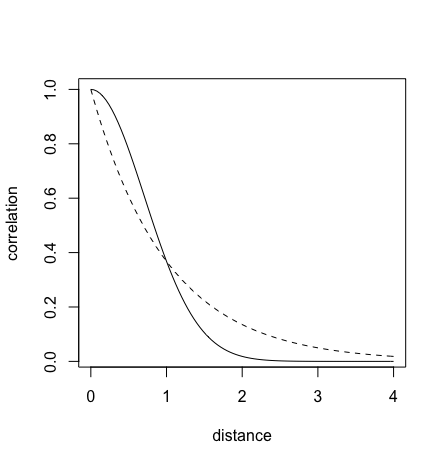

# Chapter 14 - Adventures in Covariance
```{r, include=FALSE}
library(rethinking)
library(cmdstanr)
```

Revisit robot example from last chapter - cafes can vary in their average wait time, but also in the differences of wait between morning and afternoon, model looks like:

$$
\mu_i = \alpha_{\text{CAFE}[i]} + \beta_{\text{CAFE}[i]} A_i
$$

for $A_i$ being an indicator for afternoon, and $\beta_{\text{CAFE}[i]}$ the expected difference between morning and afternoon for each cafe. Robot more efficiently learns about slopes when it pools about slopes, achieved in the same way - estimating population distributino of slopes when estimating each slope.

This is _varying effects_ strategy - any parameters with exchangable index values can and should be pooled. Exchangable here meaning no "true" ordering.

Cafes covary in intercept and slope too, which is something the robot could use - want to figure a way to pool information across parameter types. Do this via _varying slopes_. Machinery can be used to extend to more subtle model types, including continuous categories, using _Gaussian processes_, discussed in this chapter. Last chapter talks about _instrumental variables_, which can infer cause without closing back-door paths.

## 14.1 Varying slopes by construction

How to pool information across intercepts and slopes? Model joint population by modeling their covariance. Done via a joint multivariate Gaussian distribution for all varying effects.

### Simulate the population 

Using robot cafe problem

```{r}
a <- 3.5            # average morning wait time
b <- (-1)           # average difference afternoon wait time
sigma_a <- 1        # std dev in intercepts
sigma_b <- 0.5      # std dev in slopes
rho <- (-0.7)       # correlation between intercepts and slopes

Mu <- c(a,b)
```

Need 2x2 matrix of variances and covariances. Means are in ```Mu```

$$
  \begin{pmatrix}
  \text{variance of intercepts} & \text{covariance of intercepts and slopes} \\
  \text{covariance of slopes and intercepts} & \text{variance of slopes}
  \end{pmatrix}
$$

Which is 

$$
  \begin{pmatrix}
  \sigma_\alpha^2 & \sigma_\alpha \sigma_\beta \rho \\
   \sigma_\alpha \sigma_\beta \rho  & \sigma_\beta^2
  \end{pmatrix}
$$

In R (two ways):

```{r}
sigmas <- c(sigma_a,sigma_b) # standard deviations
Rho <- matrix( c(1,rho,rho,1) , nrow=2 ) # correlation matrix
Sigma <- diag(sigmas) %*% Rho %*% diag(sigmas)
```

Simulate cafes, sampling from multivariate Gaussian

```{r}
N_cafes <- 20
library(MASS)
set.seed(5) # used to replicate example
vary_effects <- mvrnorm( N_cafes , Mu , Sigma )
```

Now have a matrix with 20 rows and 2 columns, each row representing a cafe, first column an intercept, second a slope.

```{r}
a_cafe <- vary_effects[,1]
b_cafe <- vary_effects[,2]
plot( a_cafe , b_cafe , col=rangi2 ,
    xlab="intercepts (a_cafe)" , ylab="slopes (b_cafe)" )

# overlay population distribution
library(ellipse)
for ( l in c(0.1,0.3,0.5,0.8,0.99) )
    lines(ellipse(Sigma,centre=Mu,level=l),col=col.alpha("black",0.2))
```

### Simulate Observations 

Last we need to simulate the robot observing data - 10 visits, 5 in the morning and 5 in the afternoon

```{r}
set.seed(22)
N_visits <- 10
afternoon <- rep(0:1,N_visits*N_cafes/2)
cafe_id <- rep( 1:N_cafes , each=N_visits )
mu <- a_cafe[cafe_id] + b_cafe[cafe_id]*afternoon
sigma <- 0.5  # std dev within cafes
wait <- rnorm( N_visits*N_cafes , mu , sigma )
d <- data.frame( cafe=cafe_id , afternoon=afternoon , wait=wait )
```

Well suited to varying slopes - multiple clusters, each observed under different conditions.


### Varying Slopes model

\begin{align*}
  W_i &\sim \text{Normal}(\mu_i,\sigma)\\
  \mu_i &= \alpha_{\text{CAFE}[i]} + \beta_{\text{CAFE}[i]} A_i\\
  \begin{bmatrix} \alpha_{\text{CAFE}} \\ \beta_{\text{CAFE}} \end{bmatrix} &\sim \text{MVNormal}\big(\begin{bmatrix} \alpha \\ \beta \end{bmatrix},\mathbf{S})\\
\mathbf{S} &= \begin{pmatrix} \sigma_\alpha & 0 \\ 0 & \sigma_\beta \end{pmatrix} \mathbf{R}
 \begin{pmatrix} \sigma_\alpha & 0 \\ 0 & \sigma_\beta \end{pmatrix}
\end{align*}

The third line is the population of varying effects: "Each cafe has an intercept and slope with a prior defined by a two-diemnsional Gaussian, with means $\alpha$ and $\beta$, and covariance matrix $\mathbf{S}$." Fourth line constructs the covariance matrix, factoring it into separate standard deviations with a correlation matrix $\mathbf{R}$.

Hyper priors:

\begin{align*}
  \alpha &\sim \text{Normal}(5,2)\\
  \beta &\sim \text{Normal}(-1,0.5)\\
  \sigma &\sim \text{Exponential}(1)\\
  \sigma_\alpha &\sim \text{Exponential}(1)\\
  \sigma_\beta &\sim \text{Exponential}(1)\\
  \mathbf{R} &\sim \text{LKJcorr}(2)
\end{align}

Last one is a correlation matrix prior:

$$
\mathbf{R} = \begin{pmatrix} 1 & \rho \\ \rho &1 \end{pmatrix}
$$

for $\rho$ being the correlation between intercepts and slopes. This prior is weakly informative, skeptical of extreme values near -1 or 1. One parameter, e.g. LKJcorr$(1)$ is flat:

```{r}
R <- rlkjcorr( 1e4 , K=2 , eta=1 )
dens( R[,1,2])
```


```{r}
R <- rlkjcorr( 1e4 , K=2 , eta=3 )
dens( R[,1,2])
```

Compared $\eta=1$ (flat) to $\eta=3$.

Now we'll fit the model - 

```{r}
set.seed(867530)
m14.1 <- ulam(
    alist(
        wait ~ normal( mu , sigma ),
        mu <- a_cafe[cafe] + b_cafe[cafe]*afternoon,
        c(a_cafe,b_cafe)[cafe] ~ multi_normal( c(a,b) , Rho , sigma_cafe ),
        a ~ normal(5,2),
        b ~ normal(-1,0.5),
        sigma_cafe ~ exponential(1),
        sigma ~ exponential(1),
        Rho ~ lkj_corr(2)
    ) , data=d , chains=2 , cores=2 ,cmdstan=FALSE )
```


Stan code:


```
try01 <- as.character("
data{
  vector[200] wait;
  int afternoon[200];
  int cafe[200];
}
parameters{
  vector[20] b_cafe;
  vector[20] a_cafe;
  real a;
  real b;
  vector<lower=0>[2] sigma_cafe;
  real<lower=0> sigma;
  corr_matrix[2] Rho;
}
model{
  vector[200] mu;
  Rho ~ lkj_corr( 2 );
  sigma ~ exponential( 1 );
  sigma_cafe ~ exponential( 1 );
  b ~ normal( -1 , 0.5 );
  a ~ normal( 5 , 2 );
  {
    vector[2] YY[20];
    vector[2] MU;
    MU = [ a , b ]';
    for ( j in 1:20 ) YY[j] = [ a_cafe[j] , b_cafe[j] ]';
    YY ~ multi_normal( MU , quad_form_diag(Rho , sigma_cafe) );
  }
  for ( i in 1:200 ) {
    mu[i] = a_cafe[cafe[i]] + b_cafe[cafe[i]] * afternoon[i];
  }
  wait ~ normal( mu , sigma );
}
")


m14.1 <- stan( model_code = try01, data=d, chains=2)
```


Looking at posterior correlation between intercepts and slope:

```{r}
post <- extract.samples(m14.1)
dens( post$Rho[,1,2] , xlim=c(-1,1) ) # posterior
R <- rlkjcorr( 1e4 , K=2 , eta=2 )    # prior
dens( R[,1,2] , add=TRUE , lty=2 )
```

Prior is dashed, posterior is solid, concentrated on negative correlation. Considering the shrinkage, the inferred correlation was used to pool information across intercepts and slopes, this prior, learned from data, adaptively regularizes both intercepts and slopes.

```{r}
# compute unpooled estimates directly from data
a1 <- sapply( 1:N_cafes ,
        function(i) mean(wait[cafe_id==i & afternoon==0]) )
b1 <- sapply( 1:N_cafes ,
        function(i) mean(wait[cafe_id==i & afternoon==1]) ) - a1

# extract posterior means of partially pooled estimates
post <- extract.samples(m14.1)
a2 <- apply( post$a_cafe , 2 , mean )
b2 <- apply( post$b_cafe , 2 , mean )

# plot both and connect with lines
plot( a1 , b1 , xlab="intercept" , ylab="slope" ,
    pch=16 , col=rangi2 , ylim=c( min(b1)-0.1 , max(b1)+0.1 ) ,
    xlim=c( min(a1)-0.1 , max(a1)+0.1 ) )
points( a2 , b2 , pch=1 )
for ( i in 1:N_cafes ) lines( c(a1[i],a2[i]) , c(b1[i],b2[i]) )
```


## 14.5 - Continuous Categories and the Gaussian Process

Apply the idea of varying effects to continuous variables, called _Gaussian process Regression_.

### Spatial autocorrelation in Oceanic Tools

Ch 11 oceanic tool kit complexity example - previously used a crude binary contact predictor, but has some faults

- Takes no note of _which_ societies each had contact with

- If tools are exchanged, total number is not truly independent, even if conditioning on all predictors

- Closer islands may share unmeasured geographic features, so space could matter in several ways

Define a distrance matrix among societies, then estimate similarity.

In code, create a symmetric matrix of distances between place A and B.

Model starts from Poisson probability:

\begin{align*}
  T_i &\sim \text{Poisson}(\lambda_i)\\
  \lambda_i &= \alpha P_i^\beta /\gamma
\end{align*}

Now, want to make varying intercepts multiplicative:

\begin{align*}
  T_i &\sim \text{Poisson}(\lambda_i)\\
  \lambda_i &= \exp (k_\text{SOCIETY}[I]) \alpha P_i^\beta /\gamma
\end{align*}

The heart of the Gaussian process is the prior:

\begin{align*}
\begin{pmatrix} k_1\\k_2\\k_3\\...\\k_{10} \end{pmatrix} &\sim \text{MVNormal}
\begin{pmatrix} 
  \begin{pmatrix} 
    0\\0\\0\\...\\0
  \end{pmatrix}
  , \mathbf{K}
\end{pmatrix}\\

\mathbf{K}_ij &=\eta^2 \exp(-\rho^2 D_{ij}^2) +\delta_{ij} \sigma^2
\end{align*}

First line is a 10-d Gaussian prior, one dimension for each society. Covariance is second line, for any pair of societies, $ij$. Walking through it:

Shape comes from $\exp(-\rho^2 D_{ij}^2)$  - covariance declines exponentially with squared distance between them - $\rho$ is rate of decline.



Dashed line is linear distance function, solid is squared.

$\eta^2$ is maximum covariance between any societies $i$ and $j$, and the $\delta_{ij} \sigma^2$ provides for extra covariance when $i=j$ (Kronecker delta).

Full model:

\begin{align*}
  T_i &\sim \text{Poisson}(\lambda_i)\\
  \lambda_i &= \exp (k_\text{SOCIETY}[I]) \alpha P_i^\beta /\gamma \\
  \mathbf{k} &\sim \text{MVNormal}((0,\dots, 0), \mathbf{K}\\
  \mathbf{K}_ij &=\eta^2 \exp(-\rho^2 D_{ij}^2) +\delta_{ij}(0.01)\\
  \alpha &\sim \text{Exponential}(1)\\
  \beta &\sim \text{Exponential}(1)\\
  \eta^2 &\sim \text{Exponential}(2)\\
  \rho^2 &\sim \text{Exponential}(0.5)\\
\end{align*}

(note $\rho^2$ and $\eta^2$ must be positive, so exponential)

```
data(Kline2) # load the ordinary data, now with coordinates
d <- Kline2
d$society <- 1:10 # index observations

dat_list <- list(
  T = d$total_tools,
  P = d$population,
  society = d$society,
  Dmat=islandsDistMatrix )

m14.8 <- ulam(
  alist(
    T ~ dpois(lambda),
    lambda <- (a*P^b/g)*exp(k[society]),
    vector[10]:k ~ multi_normal( 0 , SIGMA ),
    matrix[10,10]:SIGMA <- cov_GPL2( Dmat , etasq , rhosq , 0.01 ),
    c(a,b,g) ~ dexp( 1 ),
    etasq ~ dexp( 2 ),
    rhosq ~ dexp( 0.5 )
  ), data=dat_list , chains=4 , cores=4 , iter=2000 )
```

Or raw stan:

```
functions{


    matrix cov_GPL2(matrix x, real sq_alpha, real sq_rho, real delta) {
        int N = dims(x)[1];
        matrix[N, N] K;
        for (i in 1:(N-1)) {
          K[i, i] = sq_alpha + delta;
          for (j in (i + 1):N) {
            K[i, j] = sq_alpha * exp(-sq_rho * square(x[i,j]) );
            K[j, i] = K[i, j];
          }
        }
        K[N, N] = sq_alpha + delta;
        return K;
    }
}
data{
    int T[10];
    int society[10];
    int P[10];
    matrix[10,10] Dmat;
}
parameters{
    vector[10] k;
    real<lower=0> g;
    real<lower=0> b;
    real<lower=0> a;
    real<lower=0> etasq;
    real<lower=0> rhosq;
}
model{
    vector[10] lambda;
    matrix[10,10] SIGMA;
    rhosq ~ exponential( 0.5 );
    etasq ~ exponential( 2 );
    a ~ exponential( 1 );
    b ~ exponential( 1 );
    g ~ exponential( 1 );
    SIGMA = cov_GPL2(Dmat, etasq, rhosq, 0.01);
    k ~ multi_normal( rep_vector(0,10) , SIGMA );
    for ( i in 1:10 ) {
        lambda[i] = (a * P[i]^b/g) * exp(k[society[i]]);
    }
    T ~ poisson( lambda );
}
```

Investigating posterior, we plot $\rho^2$ and $\eta^2$